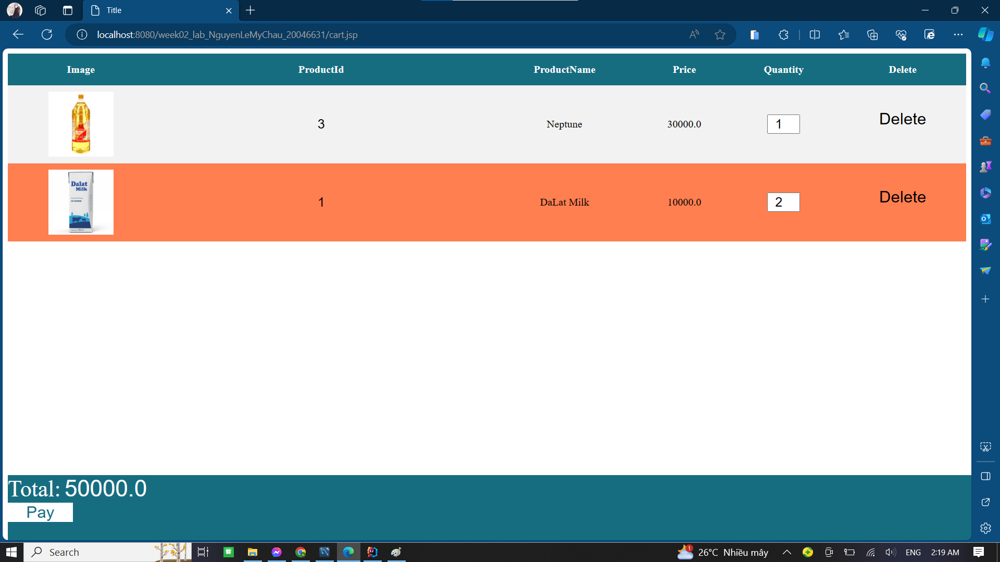
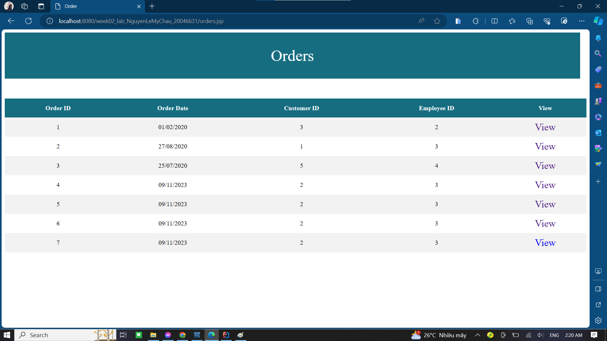
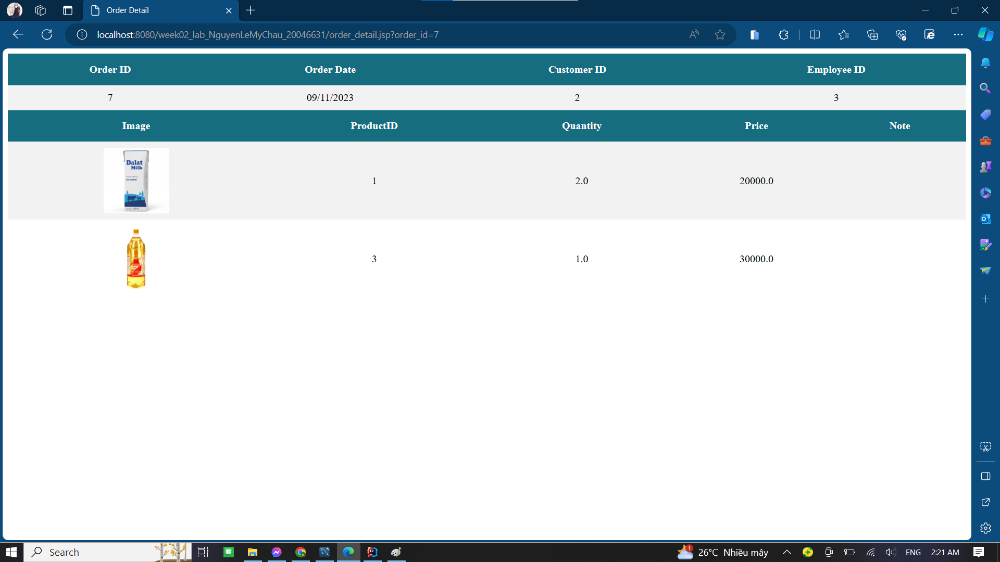

## Main Screen

## Product
1. Hiển thị lên màn hình danh sách product gồm các thông tin cơ bản nh hình ảnh, tên sản phẩm, giá tiền và nút View để xem thông tin chi tiết của sản phẩm

## Product detail
2. Tại chi tiết sản phẩm hiển thị hình ảnh và các thông tin khác của sản phẩm, đồng thời có khung nhập số lượng => Nhấn Add Cart để thêm vào giỏ hàng

=> Sau khi thêm sẽ quay trở lại trang Product để xem tiếp các sản phẩm khác

## Cart
3. Tại đây hiển thị các sản phẩm đã được thêm vào giỏ hàng trước đấy ở Product cùng tổng tiền chi trả

4. Nhấn delete để xoá sản phẩm không cần khỏi giỏ hàng

## Order
5. Nhấn Pay Now tại giỏ hàng để tiến hành lập order

6. Nhấn vào View tại Order để xem thông tin chi tiết của hoá đơn (các sản phẩm được mua)

